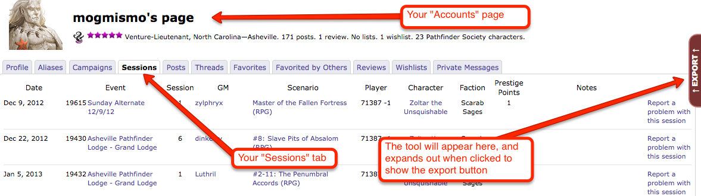

# pfs-sessiontracker-userscript
A quick userscript to create json files out of PFS games played.

1. Download Greasemonkey or Tampermonkey. These are addons for browsers to help you execute a export script on paizo.com.
2. Download and install the userscript for paizo.com from this repo.
3. Log into Paizo.com, click on your name at the top of the screen, then click on the "Sessions" tab.
4. A small slider on the right edge of the screen should be expandable to show you a button named "Export Games". Click on that and then click on "Copy to Clipboard"
5. Go to https://www.pfstracker.net/, then log into your account.  Then go to the import tool (https://www.pfstracker.net/#/import) and paste in your json data.
6. Kick back and enjoy!

